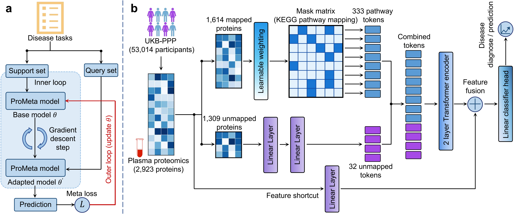

# ProMeta

## About

This repository contains the code and resources of the following paper:

ProMeta: A meta-learning framework for robust disease diagnosis and prediction from plasma proteomics

Overview of the ProMeta framework

ProMeta is a few-shot meta-learning framework specifically designed for proteomics data analysis. Addressing the limitation of deep learning in data-scarce scenarios (rare diseases), ProMeta leverages a "learning-to-learn" paradigm to adapt to new disease tasks using as few as 4 patient samples.

<p align="center">
 
</p>

## 🚀 Features

* **Robust Few-Shot Adaptation**: Outperforms transfer learning and traditional ML baselines by ~24.6% in 4-shot scenarios (2 cases, 2 controls).
* **Knowledge-Guided Encoding**: Uses ConsensusPathDB (CPDB) to map proteins to biological pathways, creating robust functional tokens.
* **Dual-View Representation**: Handles the entire proteome by processing pathway-mapped proteins and unmapped proteins (via auxiliary tokens) in parallel streams.
* **Meta-SGD Optimization**: Learns both the model initialization and task-specific learning rates, enabling rapid convergence on novel diseases.

## 📂 Project Structure

```text
├── data_preprocess/
│   ├── preprocess_data_prevalent.ipynb       # Code for prevalent disease data preproocess
│   ├── preprocess_data_incident.ipynb        # Code for incident disease data preproocess
├── resource/
│   └── CPDB_pathways_genes.tab       # Pathway knowledge database
└── ProMeta/
    ├── main.py             # Entry point for training and evaluation
    ├── config.py           # Configuration and argument parsing
    ├── dataset.py          # Data loaders and Pathway Mask generation
    ├── model.py            # ProMeta model architecture and Loss functions
    ├── utils.py            # Metrics, logging, and helper functions
    └── run_ProMeta.sh      # Shell script to run experiments
```

## 🛠️ Setup Environment

Setup the required environment using `environment.yml` with Anaconda. While in the project directory run:
```
    conda env create
```
Activate the environment
```
    conda activate ProMeta
```

## 🏃 Run ProMeta

To reproduce the experiments described in the pap
er (e.g., 4-shot or 32-shot adaptation), navigate to the source directory and execute the run script:
```
cd ProMeta
bash run_ProMeta.sh
```

You can also run `main.py` directly with custom arguments:
```
python main.py \
    --data_dir "../data/out/" \
    --proteomics_csv "../data/proteomics.csv" \
    --cpdb_path "../resource/CPDB_pathways_genes.tab" \
    --support_size 4 \
    --batch_size 8 \
    --outer_lr 1e-4 \
    --inner_lr 0.005
```

### Run TSA-ProMeta

TSA-ProMeta is a second-stage training mode. First train the original ProMeta model and keep its best checkpoint, then use it as the warmup checkpoint for task-parameter clustering:

```
python main.py \
    --data_dir "../data/out/" \
    --proteomics_csv "../data/proteomics.csv" \
    --cpdb_path "../resource/CPDB_pathways_genes.tab" \
    --support_size 4 \
    --batch_size 8 \
    --outer_lr 1e-4 \
    --inner_lr 0.005 \
    --tsa_enable \
    --num_task_groups 5 \
    --tsa_selector_steps 10 \
    --tsa_param_keys "classifier,tokenizer.gate_logits" \
    --tsa_selector_source frozen_warmup \
    --tsa_assignment_source current_group \
    --tsa_distance_mode block_mean_l2 \
    --tsa_gate_distance_weight 1.0 \
    --tsa_selector_l1_lambda 0.001 \
    --tsa_routing_schedule epoch_snapshot \
    --tsa_switch_threshold 0.05 \
    --tsa_min_group_fraction 0.05 \
    --tsa_max_group_fraction 0.50 \
    --tsa_warmup_checkpoint "./results/checkpoints/support_4/ProMeta_best_seed42.pth"
```

By default, the selector uses a frozen copy of the ProMeta warmup parameters
and Meta-SGD learning rates. K-means initializes the task groups, while later
assignments compare each support-derived task vector with the current trainable
group initializations. Classifier and gate distances are averaged within each
parameter block before they are combined. The default stable-routing mode takes
a group-parameter snapshot at the start of each epoch, assigns every training
task once, and freezes that assignment map for the whole epoch. A task switches
groups only when the relative distance improvement reaches the configured
threshold. Group-size bounds prevent empty or dominant groups.

The original online fixed-centroid behavior remains available for
reproducibility:

```
--tsa_selector_source live_model \
--tsa_assignment_source fixed_centroid \
--tsa_distance_mode global_l2 \
--tsa_routing_schedule online
```

The selector uses support samples only. Query samples are used only for the
outer-loop or meta-test loss. TSA checkpoints include the frozen selector
snapshot and assignment metadata, and result JSON files include per-task group
distance, assignment margin, switch, rebalance, group drift, and per-block
distance diagnostics. `--patience` now enables validation-AUROC early stopping.

For the 4-shot stable-routing ablation, use
`ProMeta/slurm_tsa_stable_routing_4shot.slurm`. It compares epoch-level routing
alone, routing plus hysteresis, and routing plus hysteresis and group-size
bounds. Summarize completed runs with:

```
python summarize_routing_screen.py --root /path/to/task_prometa_v3_screen
```

Every TSA run now evaluates three milestones:

- Epoch 0: K-means and group initialization only, before query-loss training.
- Epoch 1: after one complete meta-training epoch.
- Best epoch: selected only by validation AUROC; Epoch 0 may be selected.

Epoch 0 and Epoch 1 validation/test metrics are stored in the result JSON
history. Diagnostic evaluation and epoch-level routing run inside an isolated
random-state context that restores Python, NumPy, PyTorch CPU, CUDA, and
explicit DataLoader generator states.

For the strict 4-shot comparison use
`ProMeta/slurm_tsa_strict_4shot.slurm`. It runs three seeds for:

- `D_control`: online current-group routing.
- `F_epoch`: one frozen assignment map per epoch.
- `H_stable`: epoch routing plus 5% switch hysteresis and 5%-50% group bounds.

## Citation
If you find this code or our paper useful for your research, please cite:
```
@article{Li2026ProMeta,
  title={ProMeta: A meta-learning framework for robust disease diagnosis and prediction from plasma proteomics},
  author={Li, Han and Gu, Haoteng and Hu, Lei and Zhang, Zimo and Lv, Yongji and Gao, Peng and Cooper-Knock, Johnathan and Min, Yaosen and Zeng, Jianyang and Zhang, Sai},
  year={2026},
}
```
